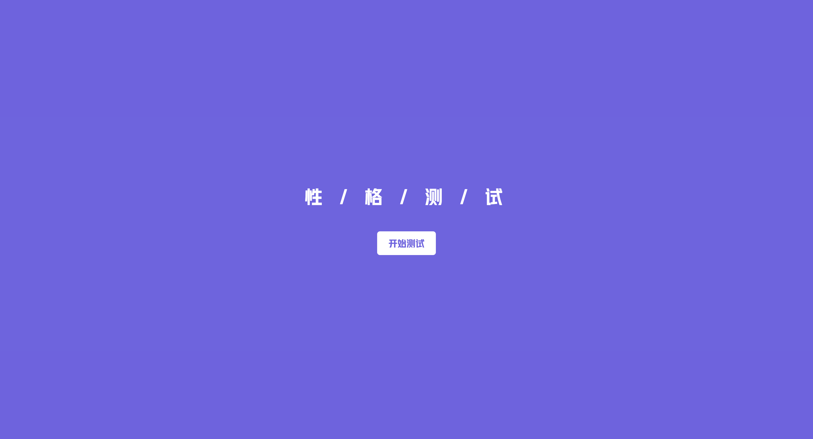
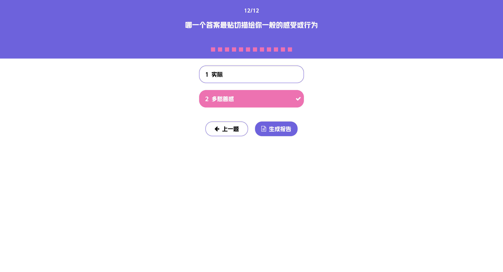

# 🧠 性格测试应用 | Personality Test App

> 基于 Vue 3 + TypeScript 构建的现代化性格测试应用，提供流畅的用户体验和专业的心理分析

[](https://vuejs.org/)
[](https://www.typescriptlang.org/)
[](https://vitejs.dev/)
[](LICENSE)

## ✨ 项目亮点

### 🎯 **现代化技术栈**

- **Vue 3 Composition API** - 更灵活的状态管理和逻辑复用
- **TypeScript** - 完整的类型安全保障，提升开发效率
- **Vite** - 极速的开发体验和构建性能
- **Vue Router 4** - 现代化的路由管理

### 📱 **优秀的用户体验**

- **响应式设计** - 完美适配移动端和桌面端
- **流畅的交互** - 自动跳转、进度指示、平滑动画
- **直观的界面** - 清晰的问题展示和结果呈现
- **无障碍设计** - 支持键盘导航和屏幕阅读器

### 🚀 **性能优化**

- **API缓存机制** - 使用 lodash memoize 减少重复请求
- **懒加载路由** - 按需加载页面组件
- **字体优化** - 自定义字体预加载
- **代码分割** - 自动化的代码分割策略

### 🎨 **精美的视觉设计**

- **现代化UI** - 紫色主题配色，简洁美观
- **自定义字体** - HYYaKuHei 字体提升视觉体验
- **图标系统** - Font Awesome 图标库
- **动画效果** - 平滑的过渡和交互动画

## 🖼️ 项目截图

### 开始页面



### 测试页面



### 结果页面


## 🛠️ 技术架构

### 核心技术

- **前端框架**: Vue 3.5.21
- **开发语言**: TypeScript 5.8.3
- **构建工具**: Vite 7.1.7
- **路由管理**: Vue Router 4.5.1
- **HTTP客户端**: Axios 1.12.2
- **样式处理**: PostCSS + Autoprefixer

### 项目结构

```
src/
├── views/              # 页面组件
│   ├── StartPage.vue   # 开始页面
│   ├── IndexPage.vue   # 测试页面
│   └── ResultPage.vue  # 结果页面
├── service/            # API服务层
│   └── fapig.ts        # 聚合数据API接口
├── router/             # 路由配置
├── helper/             # 工具函数
│   └── device.ts       # 设备检测和响应式处理
├── assets/             # 静态资源
│   ├── fonts/          # 字体文件
│   └── styles/         # 样式文件
└── App.vue             # 根组件
```

## 🚀 快速开始

### 环境要求

- Node.js >= 16.0.0
- pnpm >= 8.0.0 (推荐) 或 npm >= 8.0.0

### 安装依赖

```bash
# 使用 pnpm (推荐)
pnpm install

# 或使用 npm
npm install
```

### 环境配置

创建 `.env.local` 文件并配置API密钥：

```env
VITE_FAPIG_APP_KEY=your_api_key_here
```

### 启动开发服务器

```bash
# 使用 pnpm
pnpm dev

# 或使用 npm
npm run dev
```

### 构建生产版本

```bash
# 使用 pnpm
pnpm build

# 或使用 npm
npm run build
```

## 📋 功能特性

### 🎯 核心功能

- [x] **多页面流程** - 开始 → 测试 → 结果
- [x] **问题管理** - 动态加载和展示测试题目
- [x] **答案收集** - 实时保存用户选择
- [x] **结果分析** - 基于API的专业性格分析
- [x] **进度跟踪** - 可视化答题进度

### 📱 响应式特性

- [x] **移动端优化** - 触摸友好的交互设计
- [x] **桌面端适配** - 大屏幕下的最佳体验
- [x] **动态缩放** - 基于屏幕尺寸的字体缩放
- [x] **横竖屏支持** - 自动适配设备方向

### ⚡ 性能特性

- [x] **API缓存** - 智能缓存减少网络请求
- [x] **懒加载** - 按需加载页面组件
- [x] **代码分割** - 自动化的代码分割
- [x] **资源优化** - 字体和图片的优化加载

## 🔧 开发工具

### 代码质量

- **ESLint** - 代码规范和错误检查
- **Prettier** - 代码格式化
- **TypeScript** - 静态类型检查

### 开发体验

- **热重载** - 开发时的实时更新
- **代理配置** - 解决跨域问题
- **路径别名** - 简化的导入路径

## 📊 项目数据

- **代码行数**: ~800+ 行
- **组件数量**: 3 个主要页面组件
- **API接口**: 2 个核心接口
- **响应式断点**: 768px
- **支持浏览器**: Chrome, Firefox, Safari, Edge

## 🌟 技术亮点

### 1. **智能设备检测**

```typescript
// 自动检测设备类型并应用相应样式
export const isMobile = computed(() => clientWidth.value <= MOBILE_BREAKPOINT);
export const scale = computed(() => {
  return isMobile.value ? clientWidth.value / MOBILE_DESIGN_WIDTH : 1;
});
```

### 2. **API缓存优化**

```typescript
// 使用 memoize 避免重复请求
export const getQuestions = memoize(
  () => request<Question[]>('/fapig/character_test/questions', { level: 'senior' }),
  () => 'questions'
);
```

### 3. **响应式状态管理**

```typescript
// 使用 Composition API 管理复杂状态
const answers = ref<Map<number, string>>(new Map());
const currentQuestion = computed(() => questions.value[currentIndex.value]!);
```

## 🤝 贡献指南

欢迎提交 Issue 和 Pull Request！

1. Fork 本仓库
2. 创建特性分支 (`git checkout -b feature/AmazingFeature`)
3. 提交更改 (`git commit -m 'Add some AmazingFeature'`)
4. 推送到分支 (`git push origin feature/AmazingFeature`)
5. 打开 Pull Request

## 📄 许可证

本项目基于 MIT 许可证开源 - 查看 [LICENSE](LICENSE) 文件了解详情。

## 📞 联系方式

- **作者**: [橙续缘]
- **邮箱**: [1287338537@qq.com]

## 🙏 致谢

- [Vue.js](https://vuejs.org/) - 渐进式JavaScript框架
- [Vite](https://vitejs.dev/) - 下一代前端构建工具
- [聚合数据](https://www.juhe.cn/) - 提供性格测试API服务
- [Font Awesome](https://fontawesome.com/) - 图标库

---

⭐ 如果这个项目对你有帮助，请给它一个星标！
